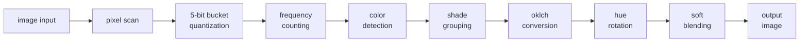
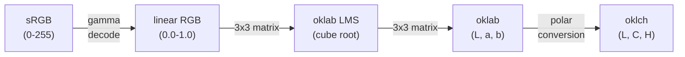
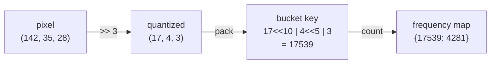
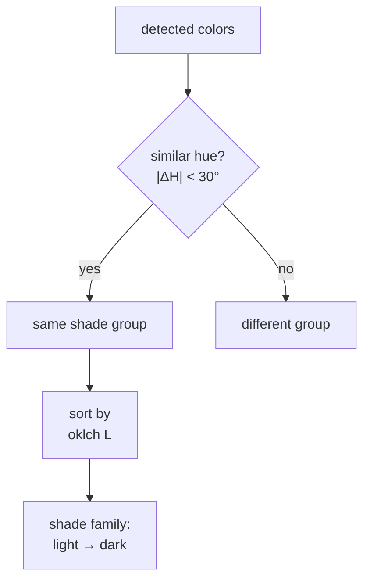
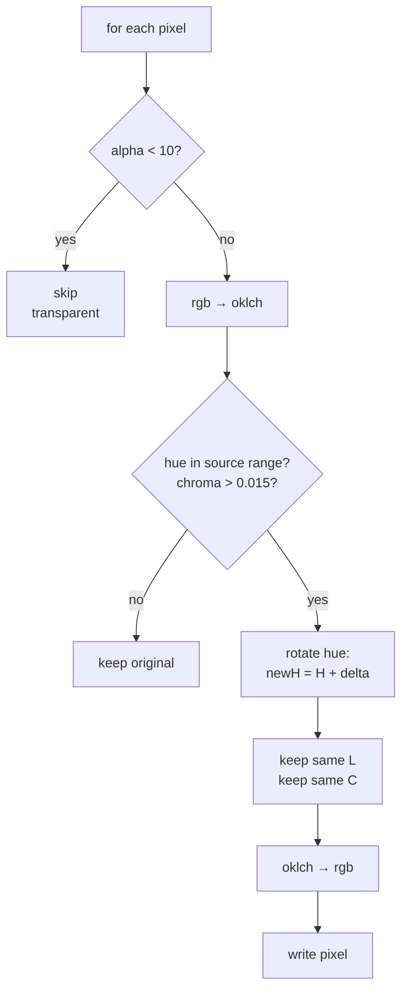
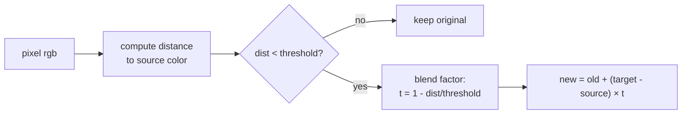
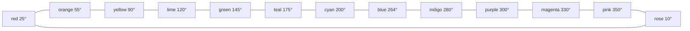

# under the hood

technical deep-dive into how swatchswap pro's recoloring engine works. covers the color math, the detection pipeline, the shade-preserving hue rotation algorithm, and why oklch matters.

## the problem with naive recoloring

most color replacement tools work like find-and-replace on hex values: find `#ff0000`, replace with `#0000ff`. this breaks immediately because:

- images contain **thousands of unique colors** due to anti-aliasing, compression artifacts, and gradients
- a "red button" might contain 200+ distinct rgb values across its gradient, shadow, and edge pixels
- replacing only the exact hex leaves all shades, shadows, and highlights untouched
- replacing with a fixed threshold produces harsh color banding at boundaries

swatchswap solves this by working in a **perceptually uniform color space** where hue, lightness, and chroma are independent axes.

## architecture overview



## color space: why oklch

swatchswap uses **oklch** (oklab lightness-chroma-hue), a perceptually uniform cylindrical color space. here's why it matters:

| property | rgb | hsl | oklch |
|----------|-----|-----|-------|
| perceptually uniform | no | no | yes |
| independent lightness | no | partially | yes |
| hue rotation preserves brightness | no | no | yes |
| chroma independent of hue | no | no | yes |

when you rotate hue in oklch, the **perceived brightness and saturation stay identical**. a dark red (L=0.4, C=0.15, H=25°) rotated to blue becomes (L=0.4, C=0.15, H=264°) — same perceived darkness, same perceived vividness, different hue. this is impossible in rgb or hsl.

## conversion pipeline



### step 1: srgb to linear rgb

srgb uses a gamma curve for display. we need to undo it:

```
if v <= 0.04045:
    linear = v / 12.92
else:
    linear = ((v + 0.055) / 1.055) ^ 2.4
```

### step 2: linear rgb to oklab

two 3×3 matrix multiplications with a cube root in between:

```
[l]   [0.4122  0.5363  0.0514] [R_lin]
[m] = [0.2119  0.6807  0.1074] [G_lin]
[s]   [0.0883  0.2817  0.6300] [B_lin]

l' = cbrt(l),  m' = cbrt(m),  s' = cbrt(s)

[L]   [ 0.2105   0.7936  -0.0041] [l']
[a] = [ 1.9780  -2.4286   0.4506] [m']
[b]   [ 0.0259   0.7828  -0.8087] [s']
```

### step 3: oklab to oklch

cartesian to polar conversion:

```
C = sqrt(a² + b²)
H = atan2(b, a) × 180/π
```

### round-trip

the reverse path (oklch → oklab → linear rgb → srgb) uses the inverse matrices and the inverse gamma function.

## color detection: 5-bit bucket quantization

scanning 237,150 pixels (465×510) would produce thousands of unique rgb values. we reduce this to a manageable palette using 5-bit quantization:



each channel is reduced from 8 bits to 5 bits (256 → 32 values), giving 32³ = 32,768 possible buckets. the bucket key packs r, g, b into a single 15-bit integer:

```
key = (r >> 3) << 10 | (g >> 3) << 5 | (b >> 3)
```

this is much faster than k-means clustering and produces consistent results. the frequency map gives us the dominant colors sorted by pixel count.

## shade grouping

once we have the detected colors, we group them into **shade families** — colors that share a similar hue but differ in lightness:



for example, a red pin image might produce:

```
shade group (H ≈ 25°):
  L=0.72  C=0.18  → light red highlight
  L=0.58  C=0.20  → main red
  L=0.41  C=0.15  → dark red shadow
  L=0.29  C=0.10  → deep shadow
```

## hue rotation algorithm

the core recoloring loop processes every pixel:



the key insight: **L and C are preserved exactly**. only H changes. this means:

- a dark shadow pixel stays exactly as dark
- a vibrant highlight stays exactly as vibrant  
- a desaturated edge stays exactly as desaturated
- gradients maintain their exact progression

## soft blending (color swap mode)

for direct hex-to-hex swaps, we use euclidean rgb distance with soft blending to preserve anti-aliasing:



the blend factor `t` creates a smooth falloff:
- at the exact source color (dist=0): t=1, full replacement
- at the threshold boundary (dist=threshold): t=0, no change
- in between: proportional blending that preserves smooth gradients

## png processing pipeline (figma plugin)

the figma plugin sandbox doesn't have browser apis (no `Blob`, `OffscreenCanvas`, `createImageBitmap`). swatchswap pro implements a **complete png codec in pure javascript**:


### pure js deflate inflate

the inflate implementation handles all three deflate block types:

1. **stored blocks** (type 0) — raw uncompressed data
2. **fixed huffman** (type 1) — predefined code tables
3. **dynamic huffman** (type 2) — per-block custom code tables

the huffman decoder uses an array-based tree structure for fast traversal:

```
tree = [[left, right], ...]
positive values → child node index
negative values → -(symbol + 1) = leaf
```

### png unfilter

each scanline has a filter type byte followed by filtered pixel data. the five filter types:

| type | name | formula |
|------|------|---------|
| 0 | none | `raw` |
| 1 | sub | `raw + left` |
| 2 | up | `raw + above` |
| 3 | average | `raw + floor((left + above) / 2)` |
| 4 | paeth | `raw + paeth_predictor(left, above, upper_left)` |

the paeth predictor picks whichever of the three neighbors (left, above, upper-left) is closest to `p = left + above - upper_left`.

## performance characteristics

| operation | 465×510 rgb image | notes |
|-----------|-------------------|-------|
| inflate (164kb → 712kb) | ~200ms | pure js, array-based huffman tree |
| unfilter | ~50ms | single pass, paeth predictor |
| oklch conversion + hue rotation (178k pixels) | ~300ms | per-pixel trig (cbrt, atan2, cos, sin) |
| png encode (stored deflate) | ~100ms | no compression, ~712kb output |
| total | ~650ms | well within interactive range |

the browser version (web/engine.js) is faster because it uses native `Canvas` and `ImageData` apis instead of manual png parsing.

## oklch hue reference



these are approximate center points. the engine uses a configurable `hueTolerance` (default: 55°) to capture the full range of a color family including warm/cool shifts.
